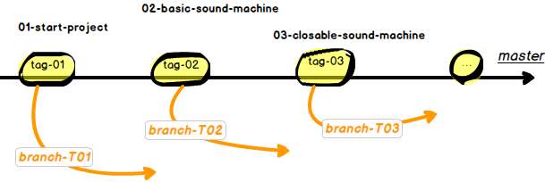
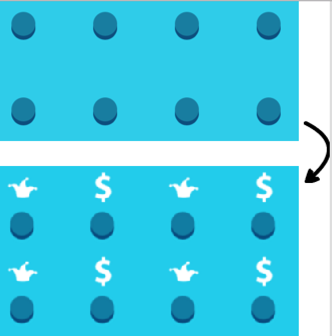
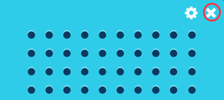
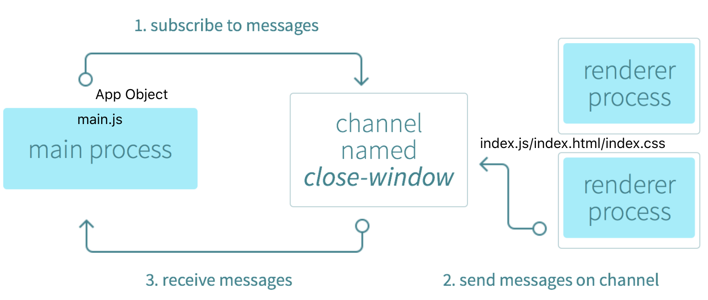

# StepByStep

<!--  toc -->

<!-- TOC depthFrom:1 depthTo:6 withLinks:1 updateOnSave:1 orderedList:0 -->

- [StepByStep](#stepbystep)
	- [使用说明](#使用说明)
	- [任务目标](#任务目标)
	- [程序结构](#程序结构)
	- [逐步重现](#逐步重现)
		- [T01 完成主进程 main.js](#t01-完成主进程-mainjs)
		- [T01 点击按钮发出声音](#t01-点击按钮发出声音)
		- [T02 进程间通信](#t02-进程间通信)
			- [教程代码](#教程代码)
			- [任务目标](#任务目标)
			- [正确做法](#正确做法)
			- [错误做法](#错误做法)
			- [自定义事件](#自定义事件)
- [参考资料](#参考资料)

<!-- /TOC -->

## 使用说明

- 下载代码

``` bash
$ git clone https://github.com/downgoon/sound-machine-electron-guide.git
$ git checkout <tag-name>
$ npm install
```

- 查看 tag 和 分支

```
$ git tag
00-blank-repository
01-start-project
02-basic-sound-machine
03-closable-sound-machine
04-global-shortcuts-bound
05-settings-window-working
06-shortcuts-configurable
07-ready-for-packaging

$ git branch
  T01
* T02
  master
```

- 版本结构



上图黑色主线是``master``主干，上面有许多``tag``，每个``tag``表示一个功能，用``tag``标记的方式记录和展示了程序功能的演进。例如``tag-02``（实际名字是``02-basic-sound-machine``）的功能是点击按钮时，发出声音；``tag-03``是在``tag-02``的基础上增加了对关闭按钮的响应。

橙色分支是供大家跟随教程学习用的。比如``branch-T01``（实际名字是``T01``），它是从``tag-01``发源的，然后自己编写代码，以达到``tag-02``的功能为终止。这样做的目的是，让读者自己动手，从``tag-01``演进到``tag-02``，相比单纯看代码演进要更有效果。

``` bash

// 进入 tag-01
$ git checkout 01-start-project

// 开启 分支学习：分支发源于 tag-01
$ git chechout -b T01

// 跟随教程，编写代码，向着 tag-02 的功能前进

// 提交自己的代码到 T01 分支

// 对比 T01分支 与 tag-02 的功能

// 对比 T01分支 与 tag-02 的代码

$ git diff T01 02-basic-sound-machine

```

## 任务目标

我们将完成的功能和探索的概念包括：

- T01：基础发声器（基本的浏览器窗口初始化），
- T02: 关闭发声器（在主进程和渲染进程之间**远程通信**），
- T03: 不需要把焦点切到应用就可以播放声音（全局快捷键），
- T04: 创建快捷键的设定界面，来变更键位（Shift，Ctrl和Alt）（保存在用户的个人文件夹设置中），
- T05: 加一个托盘图标（远程创建原生GUI元素，了解菜单和托盘图标），
- T06: 打包你的应用（把你的应用打包成 Mac，Windows，Linux下可用的版本）。

## 程序结构

``` bash
$ tree . -L 1
├── LICENSE
├── main.js
├── package.json
├── app
    ├── css
    ├── img
    ├── index.html
    ├── js
    ├── settings.html
    └── wav
```

## 逐步重现

### T01 完成主进程 main.js

```
$ git checkout 01-start-project
```

程序入口``main.js``，直接加载 ``app/index.html``：

``` javascript
app.on('ready', function() {
    mainWindow = new BrowserWindow({
        height: 600,
        width: 800
    });

    mainWindow.loadUrl('file://' + __dirname + '/app/index.html');
});
```

在``index.html``中并没有引用``node``，而是一个纯页面，可直接在本地用浏览器打开：

- 引用css

``` html
<head>
    <link href="css/bootstrap.css" rel="stylesheet" type="text/css"/>
    <link href="css/index.css" rel="stylesheet" type="text/css"/>
</head>
```

- 引用图片

``` html
<div class="speaker">
    
</div>
```

- 引用js

``` html
<script src="js/index.js"></script>
```

但此时的``js/index.js``内容是空的。

注意：现在点击没有反应，这并不奇怪，我们只有一个静态的web页面。

阅读修改的内容可以存入新分支：``git checkout -b T01``

### T01 点击按钮发出声音

截止现在点击按钮是没有声音的，因为它还只是静态页面。我们需要在``js/index.js``中增加交互代码，以便点击的时候，有声音发出。

我们的任务：

- 添加``icon``： 给几排按钮，增加``icon``图片，以便更加形象生动（图片是提前准备好的，放在``/img/icons/xxx.png``）。
- 点击发声：给按键添加``onClick``事件，当点击时，播放一段声音（声音是提前预录好的，放在``/wav/xxx.wav``里）。



页面元素选择器：
给所有按钮编号，要求做到：共性和个性。共性是指依据共性的东西可以选择所有的按钮；个性是指依据个性的东西可以选择其中一些或某个按钮。

``index.html``中的按钮：

``` html
<div class="col-xs-3">
    <div class="button-sound" data-sound="ba-dum-tsss">
        <span class="button-icon"></span>
    </div>
</div>
<div class="col-xs-3">
    <div class="button-sound" data-sound="money">
        <span class="button-icon"></span>
    </div>
</div>
```

共性的东西是``<div class="button-sound">``，个性的东西是``data-sound="money"``。

我们看看在``index.js``中添加的代码：

``` javascript

// 获取所有按钮：依据 <div class="button-sound"> 选择器
var soundButtons = document.querySelectorAll('.button-sound');

// 遍历每个按钮
for (var i = 0; i < soundButtons.length; i++) {
    var soundButton = soundButtons[i];
    var soundName = soundButton.attributes['data-sound'].value;

    // 对某个按钮添加 icon 和 点击事件侦听
    prepareButton(soundButton, soundName);
}

function prepareButton(buttonEl, soundName) {

    // 给按钮添加背景图片
    buttonEl.querySelector('span').style.backgroundImage = 'url("img/icons/' + soundName + '.png")';

    // 准备一个语音对象
    var audio = new Audio(__dirname + '/wav/' + soundName + '.wav');

    // 点击按钮时，播放声音
    buttonEl.addEventListener('click', function () {
        audio.currentTime = 0;
        audio.play();
    });
}
```

代码很简单，我们：

- 查询所有声音按钮，
- 遍历所有的按钮读取``data-sound``属性（按钮分类），
- 给每个按钮加背景图，
- 给每个按钮加一个点击事件来播放音频（调用HTML AudioElement接口）

>代码提交：``commit 49459eb98300f79a13d0``；注解：``sounding on button clicked``


对比 ``tag-01``与``tag-02``的区别，只在``index.js``加了处理逻辑：

``` bash
$ git diff 01-start-project 02-basic-sound-machine
```


### T02 进程间通信

#### 教程代码

进入``02-basic-sound-machine`` tag ：

``` bash
$ git checkout 02-basic-sound-machine
```

创建``T02``分支，以便基于``02-basic-sound-machine``阅读和变更：

``` bash
$ git checkout -b T02
```

把``T01``分支的教程``StepByStep.md``合并到``T02``分支上：

``` bash
$ git checkout T01 StepByStep.md

// 不要遗忘了 StepByStep.md 引用的图片
$ git checkout T01 assets
```

>普通的合并``git merge``是会把所有变更都合并，而``git checkout T01 StepByStep.md``只会把``T01``分支的``StepByStep.md``一个文件合并到``T02``分支。

对比前后两个 tag 内容：

``` bash
$ git diff 02-basic-sound-machine 03-closable-sound-machine
```

#### 任务目标



任务目标是在右上角的关闭按钮点击时，能够关闭窗口。


#### 正确做法




- 在``index.js``订阅关闭按钮

在``index.js``订阅关闭按钮，并在用户点击时，向``main.js``发送事件通知，以便``main.js``中执行``app.quit()``方法。

``` javascript

// event pub in renderer process

var ipc = require('ipc');

// 获取index.html中的“关闭按钮”
var closeEl = document.querySelector('.close');

// 给关闭按钮注册事件
closeEl.addEventListener('click', function () {
    ipc.send('close-main-window');
});
```

- 关闭按钮样式

关闭按钮通过：html的div，加css渲染。

关闭按钮在index.html里面的位置：

``` html
<div class="close">Close</div>
```

关闭按钮在index.css里面的样式：

``` css
.close {
    cursor: pointer;
    display: inline-block;
    height: 32px;
    position: absolute;
    text-indent: -10000px;
    top: 6px;
    width: 32px;
    z-index: 1;

    -webkit-app-region: no-drag;
}
```

- 在main.js进行事件响应

``` javascript

// event sub in main process
var ipc = require('ipc');

// 处理`close-main-window`事件
ipc.on('close-main-window', function () {
    app.quit();
});
```

处理`close-main-window`事件的核心动作就是执行``app.quit()``。

提交点是：``T02``分支的``commit 740e75a2f7a2194``，注解是：``quit right``。

#### 错误做法

为什么关闭程序，非要用``事件机制``呢？ 我们能不能直接在``index.js``里面，监听点击事件，并且执行``app.quit()``呢？

比如在``index.js``里面的代码：

``` javascript
// get app directory in index.js

// 直接在index.js里面获取app对象
// var appIndex = require('app');
var appIndex = require('electron').app;

// 当点击关闭按钮时，直接执行app.quit()
var closeEl = document.querySelector('.close');
closeEl.addEventListener('click', function () {
    console.log('quit directory in index.js');
    appIndex.quit();
});
```

然后这样的代码``npm start``运行适，直接异常：

```
[23169:0613/130237:INFO:CONSOLE(336)] "Uncaught Error: Cannot find module 'app'", source: module.js (336)
[23234:0613/130306:INFO:CONSOLE(336)] "Uncaught Error: Cannot find module 'electron'", source: module.js (336)
```

>也就是说，在渲染进程``index.js``是不允许获取``electron``的，不允许获取``electron.app``对象的。

官方资料显示：

>在web页面（``index.js/css/html``），不允许调用原生GUI相关的API（``electron.app``和``electron.BrowserWindow``），因为在web页面管理原生GUI资源是很危险的，会很容易泄露资源。如果你想在web页面施行GUI操作，web页面的渲染进程必须要与主进程通信，请求主进程来完成这些操作。

代码提交是``T02``的``quit error``，提交：``commit 75f94105854094f3``。

#### 自定义事件

把``close-main-window``事件写成``mydef-close-main-window``，也是可以的。

``npm start``后的日志显示：

``` bash
[24629:0613/133122:INFO:renderer_main.cc(200)] Renderer process started
```

代码提交是``T02``的``quit on mydef event``，提交：``commit 8b6bbde6f7086adf884e4``。

### T03 向着快捷键前进

#### 任务目标

我们刚完成了 ``tag-03``的功能，现在要朝着 ``tag-04``的功能前进。为此我们先看看 ``tag-04`` 的功能是什么。

``` bash
$ git checkout 04-global-shortcuts-bound
$ npm start
```

然后按快捷键``ctrl+Shift+1``和``ctrl+Shift+2``就会发出声音。简单说就是在``tag-03``的依靠鼠标点击按钮的基础上，增加了快捷键的交互方式。

#### 教程代码

准备从``tag-03``开个分支，叫``T03``的，向着 ``tag-04``的目标功能前进。

``` bash
$ git checkout 03-closable-sound-machine
$ git checkout -b T03
$ git checkout T02 StepByStep.md assets
$ git add .
$ git commit -m 'merge StepByStep.md and assets into T03'
```

#### 背景知识

- ``global-shortcut`` 库

快捷键硬件资源的使用，需要用到 ``electron``的 ``require('global-shortcut');`` 库。这个库是``global``的，必须在主进程（``main.js``）中使用，无法在页面渲染进程（``index.js``）中使用，否则会报错：

```
[28177:0613/150115:INFO:CONSOLE(336)] "Uncaught Error: Cannot find module 'global-shortcut'", source: module.js (336)
```

在``electron``新版本中，把``electron``相关库都整合在一起，会方便很多：

``` javascript
var electron = require('electron');
console.log('globalShortcut: ' + electron.globalShortcut.isRegistered('ctrl+x'));
```

这样我们只需理解并记住：

>``require('electron');`` 只出现在 ``main.js``中，其他渲染的js都不能引用``electron``，必须借助``IPC``机制实现跨进程的消息事件机制。


- 事件传递

>Why ``mainWindow.webContents.send`` rather than ``ipc.send`` used in tag ``03-closable-sound-machine``

>i am a java programmer and know only a little about ``electron`` and ``node.js``, thanks very much for your step-by-step style tutorial [building-a-desktop-application-with-electron](https://medium.com/developers-writing/building-a-desktop-application-with-electron-204203eeb658)  and source code [sound-machine-electron-guide](https://github.com/bojzi/sound-machine-electron-guide).

>i don't understand this gist. in the tag named ``03-closable-sound-machine``,  it is through ``IPC`` channel that button clicking events are generated in renderer process and sent to the main process. why can't i code like as follows in tag ``04-global-shortcuts-bound``   ?  thanks a lot.

>
``` javascript
var globalShortcut = require('global-shortcut');
var ipc = require('ipc');    // load ipc module
app.on('ready', function() {
    ... // existing code from earlier

    globalShortcut.register('ctrl+shift+1', function () {
           //  mainWindow.webContents.send('global-shortcut', 0);
           ipc.send('global-shortcut', 0);
    });
    globalShortcut.register('ctrl+shift+2', function () {
        // mainWindow.webContents.send('global-shortcut', 1);
        ipc.send('global-shortcut', 1);
    });
});
```
[这个 gist](https://gist.github.com/bojzi/e805132f2c737d1a39c4#file-main-js) 让人有点不明白：

之前作者说的都是基于``IPC``进行事件传递（从渲染进程到主进程）。现在从主进程到渲染进程，却没法完全用``IPC``，而是在主进程中用``mainWindow.webContents.send``，在渲染进程中才继续用``ipc.on``。这是为什么？

#### 正确做法


---

# 参考资料

- [扬声器（英文版）](https://medium.com/developers-writing/building-a-desktop-application-with-electron-204203eeb658)
- [扬声器（中文版）](http://get.ftqq.com/7870.get)
- [git从其他分支merge个别文件](http://www.cnblogs.com/-mrl/p/6648668.html)
